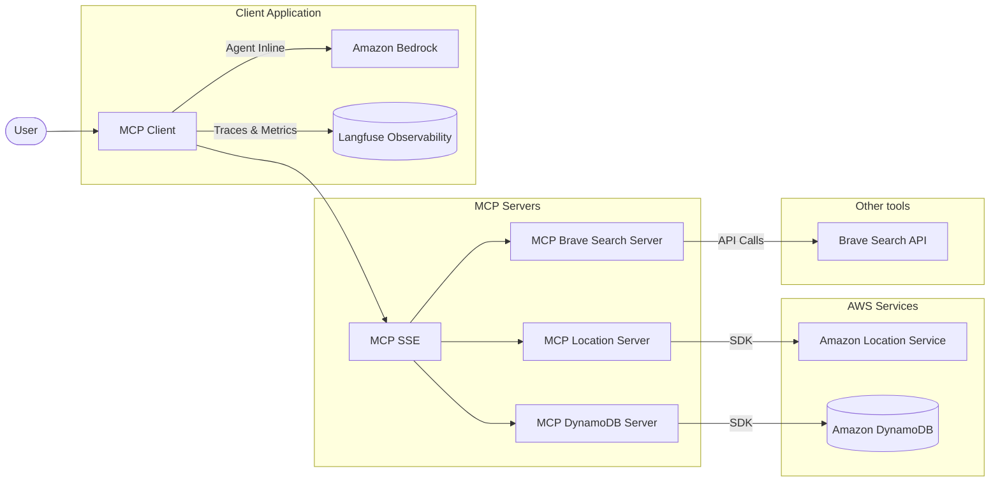
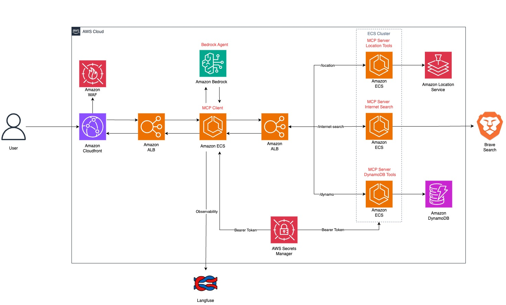

# MCP Sample Route Optimizer

A reference implementation of Model Context Protocol (MCP) client-server architecture designed for logistics and route optimization applications. This project showcases the integration of location services, database management, and internet search capabilities within a scalable AWS infrastructure.

## Overview

This sample provides a comprehensive solution for logistics operations by leveraging the Model Context Protocol to connect AI agents with specialized tools for:

- Location services and route optimization
- Database access for logistics data
- Internet search capabilities for real-time information
- Data analysis and visualization

The architecture follows a modular approach with specialized MCP servers that handle different aspects of logistics operations, all accessible through a unified client interface.

## Components

### MCP Servers

#### 1. MCP DynamoDB Server

Provides access to logistics data stored in DynamoDB tables:

- **mcp-produtos**: Product catalog with inventory information
- **mcp-clientes**: Customer information and delivery preferences
- **mcp-pedidos**: Order details and status tracking
- **mcp-veiculos**: Vehicle fleet information and availability
- **mcp-entregas**: Delivery tracking and scheduling data

#### 2. MCP Location Server

Integrates with Amazon Location Service to provide:

- Place search and geocoding
- Route calculation and optimization
- Nearby point-of-interest discovery
- Real-time "open now" business status
- Reverse geocoding for coordinates to addresses

#### 3. MCP Brave Search Server

Enables internet search capabilities for:

- Current market information and logistics trends
- Web content inspection and extraction
- Research on shipping options and regulations

### MCP Client

The client application connects to these MCP servers and integrates with Amazon Bedrock to create an AI agent specialized in logistics operations. The client:

- Manages authentication with MCP servers
- Handles request/response communication via the MCP protocol
- Integrates with Langfuse for observability and performance tracking
- Provides visualization capabilities for logistics data

## Architecture Diagram

This architecture is designed to be implemented in a scalable AWS environment suitable for production-ready deployments. The containerized MCP servers can be deployed on Amazon ECS with auto-scaling capabilities to handle varying workloads, while leveraging managed services like Amazon Location Service and DynamoDB for reliability and performance.

Infrastructure as Code (IaC) templates using AWS CDK or Terraform are planned for a future release to facilitate automated deployment and configuration management. Currently, the repository focuses on the core functionality and server implementations.

## Security

All MCP servers implement token-based authentication
Communication between components is secured with HTTPS
AWS Secrets Manager is used for credential management
Access to AWS services is controlled via IAM policies

## Observability

The system integrates with Langfuse for comprehensive observability:

Trace all AI interactions and tool usage
Monitor costs associated with model usage
Track performance metrics for optimization

## Acknowledgments

References for this samples:

- [Bedrock Agent Inline SDK](https://github.com/awslabs/amazon-bedrock-agent-samples/tree/main/src/InlineAgent)
- [Guidance for deploy MCP on AWS](https://github.com/aws-solutions-library-samples/guidance-for-deploying-model-context-protocol-servers-on-aws)
- [AWS Labs MCP repository](https://github.com/awslabs/mcp)
